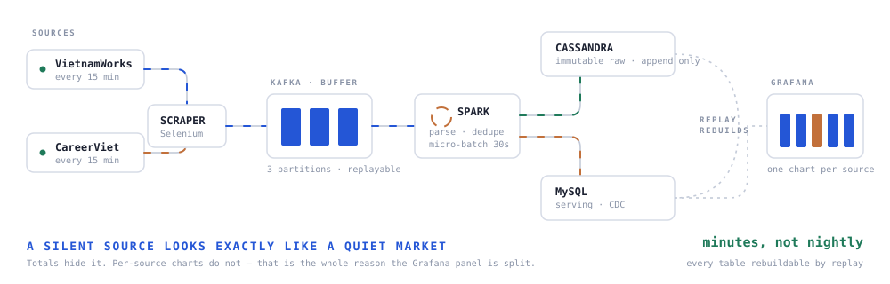

# Live Job Market Tracker — real-time streaming pipeline


[](https://github.com/nhmTri/Job_realtime/actions/workflows/build.yml)



A production-shaped streaming pipeline that picks up job postings from **two Vietnamese job boards** as they are published, so the market picture is never more than minutes old.

**2 live sources · postings visible in minutes · 100% of downstream tables rebuildable by replay · runs unattended**

**[▶ Demo video](https://drive.google.com/file/d/1aO0HcwiDrikLpJdjmnNt2w2aO_Rrj1hF/view?usp=sharing)** · **[Pipeline diagram](https://drive.google.com/file/d/1P1SQnOJ7jaD-LYXaUq8Jpr_QDDboB5x8/view?usp=sharing)**

---

## Architecture

| Layer | Technology | Why |
|---|---|---|
| Scraper | Selenium, Playwright | Two sites, two rendering behaviours |
| Cache | Redis | Deduplicate before anything hits the queue |
| Queue | Apache Kafka | Decouple scraping speed from processing speed |
| Stream | Spark Streaming | Parse, dedupe and shape in flight |
| Raw layer | Cassandra | Immutable, append-only — the replay source |
| Serving | MySQL | Query-ready OLAP tables for the dashboard |
| CDC | `scraped_at` in Cassandra vs `cdc` in MySQL | Only new or changed rows move forward |
| Dashboard | Grafana | Throughput and job category breakdown |
| Enrichment | Gemini API | Skill extraction from free-text descriptions |

## The lesson this project taught me

**A silent source looks exactly like a market with no new jobs.** Throughput charts on the total hide it completely — only **per-source monitoring** tells them apart. That is why Grafana watches each source separately, and why a source that stops sending is noticed the same day.

## Design choices

- **Immutable raw layer.** Cassandra keeps every posting exactly as received. Every downstream table can be rebuilt by replay, so a bad transform is never a data loss event.
- **CDC instead of full reload.** Comparing `scraped_at` against the last CDC watermark moves only what changed.
- **Containerised.** Every service runs as a container; the whole stack comes up with one command.

## Run it

```bash
git clone https://github.com/nhmTri/Job_realtime.git
cd Job_realtime
cp .env.example .env     # set your Gemini key and DB passwords
make up                  # Kafka, Cassandra, MySQL, Redis, Grafana
make run                 # compile every module and start the pipeline
```

`make` targets: `up` `down` `build` `run` `logs` `clean`. A root aggregator POM builds all six modules in dependency order.

Grafana: http://localhost:3000 · MySQL: `localhost:3306` · Cassandra: `localhost:9042`

## Modules

```
scraper/                Selenium + Playwright scrapers, writes to Redis then Kafka
kafkastreaming/         Kafka producer/consumer, Spark writes to Cassandra
casstomysql/            Change Data Capture, Cassandra → MySQL
common-lib/             DTOs, Gemini API client, shared utils
apprunner/              AppRunner.java — the pipeline entry point
cassandra_init/         Keyspace and table DDL
mysql_grafana_init/     Serving schema and Grafana provisioning
```

## What I took from it

How a production data system stays up: **buffer, replay, serve, monitor** — in that order.

---

**Stack** · Java · Spark Streaming · Kafka · Cassandra · MySQL · Redis · Docker · Grafana
**More** · [portfolio case study](https://portfolionhmtri.netlify.app)
